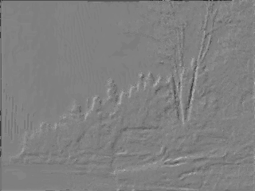
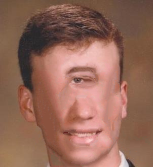

# pyImageAnalogies

A Python implementation of the basic features Image Analogies technique for style transfer ([1]), which is an incredibly simple but effective classical technique which is an alternative to complicated deep learning approaches if the example image pair is in perfect correspondence.  Features in this implementation include multiresolution pyramids and coherence search weighted against approximate nearest neighbor search over all patches.

* ([1]) A. Hertzmann, C. Jacobs, N. Oliver, B. Curless, D. Salesin. ``Image Analogies.''  SIGGRAPH 2001 Conference Proceedings.

## Dependencies
All of the dependencies below are pip installable
* Numpy/Scipy/Matplotlib
* scikit-image
* imageio
* sklearn

## Running
To see all options, run the script as follows
~~~~~ bash
python ImageAnalogies.py --help
~~~~~

## Examples

Below are some examples

### Simple Linear Emboss Filter

~~~~~ bash
python ImageAnalogies.py --A images/newflower-src.jpg --Ap images/newflower-emboss.jpg --B images/toy-newshore-src.jpg --Bp results/toy-newshore-emboss.png
~~~~~

<table>
<tr><td><h2>A</h2></td><td><h2>A'</h2></td></tr>
<tr><td></td><td></td></tr>
<tr><td><h2>B</h2></td><td><h2>B'</h2></td></tr>
<tr><td></td><td></td></tr>
</table>

### Nonlinear Artistic Filter

~~~~~ bash
python ImageAnalogies.py --A images/chair.png --Ap images/chair-stipple.png --B images/girl.png --Bp results/girl-stipple.png --NLevels 4
~~~~~

<table>
<tr><td><h2>A</h2></td><td><h2>A'</h2></td></tr>
<tr><td></td><td></td></tr>
<tr><td><h2>B</h2></td><td><h2>B'</h2></td></tr>
<tr><td></td><td></td></tr>
</table>

### Texture By Numbers

~~~~~ bash
python ImageAnalogies.py --A images/me-mask.png --Ap images/me.jpg --B images/cyclopsmask.png --Bp results/mecyclops.png --Kappa 0.1 --NLevels 2 
~~~~~

<table>
<tr><td><h2>A</h2></td><td><h2>A'</h2></td></tr>
<tr><td></td><td></td></tr>
<tr><td><h2>B</h2></td><td><h2>B'</h2></td></tr>
<tr><td></td><td></td></tr>
</table>

## Texture Synthesis

~~~~~ bash
python ImageAnalogies.py --A images/texture1.A.png --Ap images/texture1.Ap.png --B images/texture1.B.png --Bp results/texture1.Bp.png
~~~~~

<table>
<tr><td><h2>A</h2></td><td><h2>A'</h2></td></tr>
<tr><td></td><td></td></tr>
<tr><td><h2>B</h2></td><td><h2>B'</h2></td></tr>
<tr><td></td><td></td></tr>
</table>

Now let's do the same experiment as above, but with coherence

~~~~~ bash
python ImageAnalogies.py --A images/texture1.A.png --Ap images/texture1.Ap.png --B images/texture1.B.png --Bp results/texture1.Bp_Kappa1.png --Kappa 1
~~~~~

<table>
<tr><td><h2>A</h2></td><td><h2>A'</h2></td></tr>
<tr><td></td><td></td></tr>
<tr><td><h2>B</h2></td><td><h2>B'</h2></td></tr>
<tr><td></td><td></td></tr>
</table>

[1]: <https://mrl.nyu.edu/projects/image-analogies/>
